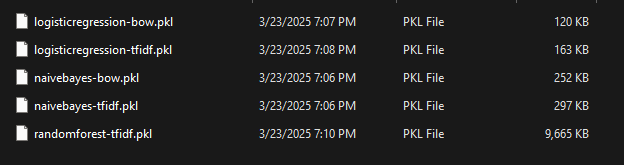

# Goal
Fetch reviews of products from random sources to do sentimental analysis so `we may predict if a comment of a review is POSITIVE or NEGATIVE` in `MALAGASY` language

# Steps
- [x] Format the reviews in `data/original.txt` into a more raeadable format (CSV) ONLY with positive/negative reviews
- [x] Load the CSV (to train the model)
- [x] Train and test the model
- [] Traduct the language to Malagasy
- [] Train and test another model
- [] Do an e-commerce like website to add comments on a product

# How to run
```bash
py run.py
```

# Modules
To install non native modules of python-3:

```bash
pip install pandas sklearn gensim openpyxl
```

# Note
Best combo so far:
```
logisticregressionmodel-tfidf
Accuracy: 0.7505567928730512
Classification report:                precision    recall  f1-score   support

          -1       0.75      0.89      0.81       274
           1       0.76      0.53      0.62       175

    accuracy                           0.75       449
   macro avg       0.75      0.71      0.72       449
weighted avg       0.75      0.75      0.74       449

This is the best product I bought: 1
I really hate the experience, very bad service!: -1
It s okay: -1
Absolutely amazing! I will buy again: -1
Worst product I bought ever: -1
I rate it 10/10, very good: 1
Not good: -1
good: 1
Very good product: 1
Do not buy this product: -1
Why do people sell this, it s the worse product here: -1
```

# Comparison
